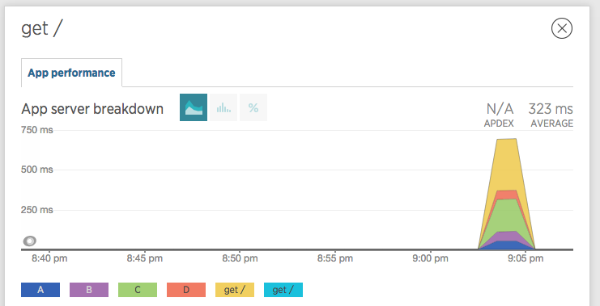
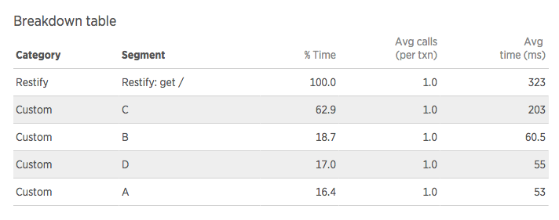
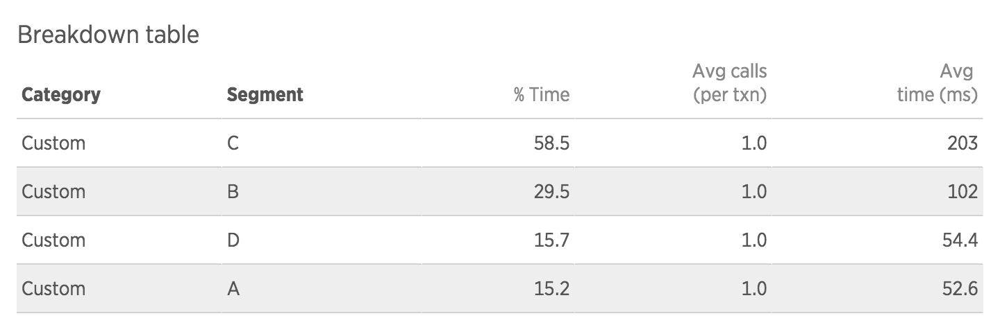

# NewRelic / Restify

This example responds to every `/` request with the same code path:

```bash
        request
           |
           A (50ms)
          / \
         |   |
 (100ms) B   C (200ms)
         |   |
          \ /
           |
       Untraced 50ms
           |
           D (50ms)
           |
        response
```

Given the above, the total request takes `350ms`.
There is also a small `50ms` delay that isn't part of any tracer.


## NewRelic Node agent 1.16.4

In the previous version of the Node agent (`1.16.4`), this is what was captured:



- You can notice a small bug where the *top-level* transaction is duplicated, in yellow and teal
  - this bug is fixed in version `1.17.0`

- All tracers are displayed as stacked areas
  - this is a tricky one to solve, because in `Node` tracers could be in series, in parallel, or even overlap with each other.
  - a stacked display is probably fine as long as it's clear we're looking at tracers
  - one potential option is to display them differently from the top-level transaction, for example as **lines** if the transaction time is an area

- The top level transaction, in yellow, is stacked above all the tracers
  - this makes it quite hard to read, because looking at the `Y` axis, it seems the average is `750ms`
  - ideally, the transaction would be plotted as a **non-stacked** area, regardless of the tracers, so the `Y`-value is always relevant and can be read at a glance
  - I note that we can read the **real** average in the top-right (`323ms`). While that's nice, it's not enough to inspect the fluctuations, peaks and trophs in the current time window.

In the breakdown, everything looks great:



The top-level transaction here displays the right time (`323ms`), and is marked correctly as taking `100%` of the time.

Again, the person reading this should consider that tracers could have executed in parallel, or even been skipped in some instances... but it still provides a lot of value to compare them relatively to each other.

## NewRelic Node agent 1.17.0

That's where it got interesting:


- the duplicate bug was fixed
- all tracers are still picked up, displayed as stacked values
- but the top-level (blue) `get /` entry isn't plotted?
- we've also had cases where the top-level transaction **did** appear, but instead of the whole response time it represented the "remainder" time after the tracers, so in this case `50ms`. I'm not sure why it disappeared this particular time.

The breakdown is similar:



- in the other cases where `get /` was plotted, it also appeared in the breakdown table, but again its value was the remainder, so around `50ms`, instead of the full `323ms`

As before, we can still read the **actual** full transaction time in the top-right, however this only represents an average. Being able to read the fluctuations on the graphs was very valuable information.
