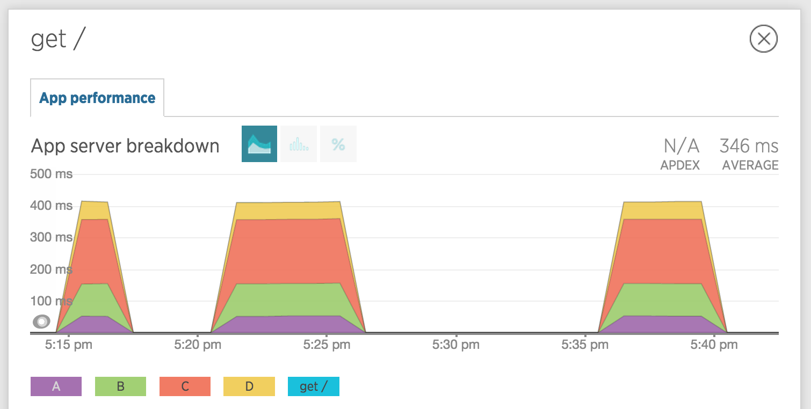

# NewRelic / Restify

This example responds to every `/` request with the same code path:

```bash
        request
           |
           A (50ms)
          / \
         |   |
 (100ms) B   C (200ms)
         |   |
          \ /
           |
       Untraced 50ms
           |
           D (50ms)
           |
        response
```

Given the above, the total request takes `350ms`.
There is also a small `50ms` delay that isn't part of any tracer.

## What we see

NewRelic picks up the `/` transaction successfully, but displays it as:



- All tracers are picked up
- They are displayed as stacked values, which doesn't represent the async reality, but I don't think there is an easy solution to that. Knowing that they are tracers, it's up to the person reading the graphs to know **not** to add them up. However this is still useful to compare how long they take relative to each other
- The total `GET /` blue entry doesn't appear on the chart. We have other cases where it **did** appear, and represented the "remainder" time after the tracers, in our case `50ms`. I'm not sure why this case is different.

The breakdown is similar:


Note that we can still see the total average time (`346ms`) in the top right. However, in a real-world scenario where the transaction & tracer times will vary a lot over time, we lost the ability to see the fluctuations, peaks and troughs in the current time window.

**Note**: in the previous version of the Node agent (1.16), the blue line represented the whole transaction, and was plotted as another stacked area on the chart. This was hard to read, because the `Y`-value was much higher than the actual value (since it was stacked), but at least it was represented on the chart and the breakdown table with the actual full-end-to-end transaction duration.

## What we would like to see

Ideally, both the total transaction and tracers would be shown.

- the total transaction as a solid chart, anchored at the bottom of the Y axis. This means we can
  - see its fluctuations over time
  - hover to see the exact total times
- the tracers as lines on the chart, so it's obvious they should not be added to the total response time. They could potentially be stacked or not, which doesn't matter since neither will represent the fact they can be in series, parallel, or even overlap in an async world.
